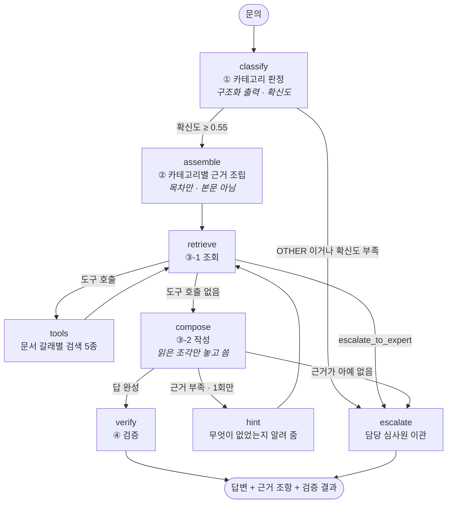
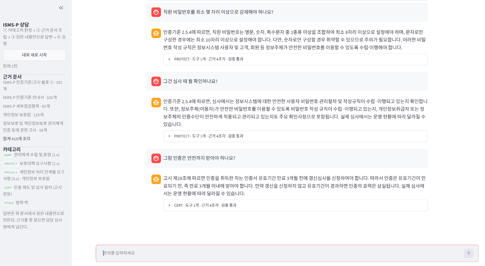
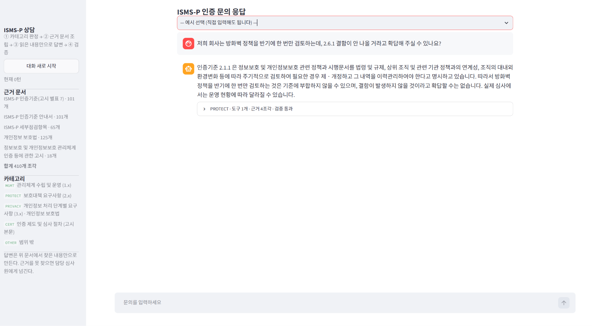

# ISMS-P 인증 문의 응답 에이전트

문의를 **카테고리로 나누고 → 그 카테고리의 근거 문서만 열어 → 읽은 내용만으로 답하고 → 검증한다.**
근거를 못 찾으면 답하지 않고 담당 심사원에게 넘긴다.

### 수치를 두 벌로 적는다

개선은 `eval` 16건의 실패를 하나씩 읽고 고치는 방식으로 아홉 차례 반복했다.
그래서 이 16건 수치는 **개선의 대상이 된 집합**이고, 잘 나오는 것이 당연하다.
따로 떼어 두고 **한 번도 들여다보지 않은 4건**을 포함한 전체 20건 수치를 같이 적는다.

| 지표 | 기준선<br>(eval 16건) | 최종<br>(eval 16건) | 최종<br>**전체 20건** |
|---|---:|---:|---:|
| **① 도구 호출 적절성** | 47.9% | 97.5% | **98.3%** |
| **② 답변 적절성** | 64.6% | 81.2% | **75.0%** |
| 반복 횟수 | 3회 | 5회 | 3회 |
| 회차 간 폭 | ±1%p / ±3%p | ±6%p / ±12%p | ±5%p / ±10%p |

**카테고리 분류** — 답변용 평가셋과 별도로, 경계를 찌르는 문항을 따로 모아 쟀다
(`data/routing_set.json` · 3회 반복).

| 분류 지표 | 경계 문항 32건<br>투입 직후 | 규칙 보강 후 | + 자유 입력에서<br>찾은 6건 (38건) |
|---|---:|---:|---:|
| 정확도 | 0.896 | 0.969 | **0.974** |
| macro F1 | 0.899 | 0.971 | **0.975** |
| 오분류 | 4건 | 1건 | 1건 (아래) |

혼동 행렬과 오분류 원인 분석은 [분류 성능](#분류-성능--정확도--macro-f1--혼동-행렬) 에 있다.
분류 규칙을 손볼 때 보지 않은 `goldenset` 20건으로 다시 재면 정확도·macro F1 모두 1.000 이다.

**뒤에 덧붙인 두 평가셋** — 자유 입력에서 찾은 거친 문의(`wild`)와 멀티턴이다.
둘 다 기존 평가셋으로는 잡히지 않던 실패를 드러냈다.

| 평가셋 | ① 도구 | ② 답변 | 분류 | 무엇을 드러냈나 |
|---|---:|---:|---:|---|
| `eval` 16건 | 93.8% | 79.2% | 100% | 개선의 대상이 된 집합 |
| `wild` 5건 — 구어체·축약 | 80.0% | 46.7% | 100% | **부당한 이관**과 검색의 구어체 취약성 |
| 멀티턴 12턴 | 88.9% | 97.2% | 100% | 주제 유실, 지시어 오판 |
| **전체 25건 (최신)** | **86.7%** | **65.3%** | **100%** | 세 갈래를 한꺼번에 잰 값 |

`wild` 를 넣기 전에는 ① 40.0% · ② 6.7% 였다. 무엇이 문제인지 보이니 고칠 수 있었다.

**이 프로젝트에서 가장 중요한 결과는 지표를 올린 것이 아니라,
지표가 얼마나 쉽게 나를 속이는지 세 번 확인한 것이다.**

| 재는 대상을 바꿨을 때 | 전 | 후 |
|---|---:|---:|
| 답변: 개선에 쓴 16건 → 한 번도 안 본 4건 포함 | 83.8% | **66.7%** |
| 분류: `goldenset` 16건 → 경계 문항 32건 | 100% | **89.6%** |
| 자유 입력 12건을 손으로 넣어 직접 읽음 | — | **12건 중 5건 문제** |

세 번 다 **튜닝하지 않은 입력을 넣자마자 떨어졌다.** 그리고 세 번 다
떨어진 수치보다 **새로 드러난 실패 유형**이 더 값졌다 — 보류 집합에서는 조건 누락,
경계 문항에서는 PROTECT 과잉 흡수, 자유 입력에서는 과잉 이관이 나왔다.
자세한 내용은 [과적합을 확인했다](#과적합을-확인했다) 와
[자유 입력으로 점검했다](#자유-입력으로-점검했다--평가셋이-구조적으로-못-잡던-실패) 에 적었다.

모든 수치는 **여러 번 반복한 평균**이다. LLM 은 같은 입력에도 결과가 달라서
한 번 재고 좋아졌다고 말하면 안 된다. 실제로 이 프로젝트에서도 한 건이 뒤집히면
6.25%p 가 움직였고, 그 때문에 개선인 줄 알았던 변경이 노이즈였던 적이 두 번 있었다.

---

## 1. 주제와 근거 문서

### 왜 ISMS-P 인가

ISMS-P(정보보호 및 개인정보보호 관리체계) 인증 문의는 이 과제에 잘 맞는 성질이 세 가지 있다.

1. **답이 반드시 문서에 있어야 한다.** 심사 기준을 잘못 안내하면 기업이 준비를 헛하거나
   결함을 맞는다. "대충 맞는 말" 이 아니라 조항 번호까지 대야 쓸모가 있다.
2. **문의 종류마다 펼쳐야 할 문서가 다르다.** 같은 "암호화" 문의라도 법적 의무를 물으면
   개인정보 보호법, 구현 방법을 물으면 인증기준 안내서다. 카테고리를 나눌 실익이 분명하다.
3. **모델이 그럴듯하게 지어내기 쉽다.** "비밀번호는 6개월마다 바꿔야 한다", "유출은 72시간 안에
   신고해야 한다" 같은 말은 실무에서 흔히 돌지만 우리 문서에는 없다. 그라운딩이 되는지
   아닌지가 눈에 띄게 갈린다.

### 근거 문서

모두 공개된 원문이다. `docs/` 에 내려받은 그대로 두고 손대지 않았다. 어느 문서가 어느
카테고리에 속하는지는 코드(`corpus.py`)로 표시한다. 원문을 고치지 않아야 나중에 출처를 검증할 수 있다.

| 문서 | 조각 수 | 담고 있는 것 |
|---|---:|---|
| ISMS-P 인증기준 (고시 별표 7) | 101 | 1.x 관리체계 16 · 2.x 보호대책 64 · 3.x 개인정보 처리단계 21 |
| ISMS-P 인증기준 안내서 | 101 | 각 인증기준의 이행 방법, 작성규칙 예시, 결함 사례 |
| ISMS-P 세부점검항목 | 65 | 심사에서 확인하는 항목과 제출 증적 |
| 개인정보 보호법 | 125 | 제1조 ~ 제76조 전문 |
| 인증 등에 관한 고시 본문 | 18 | 제17조 ~ 제36조 (신청·의무대상·수수료·심사·사후관리·갱신·취소·이의신청) |
| **합계** | **410** | |

### 검색

형태소 분석기 없이 **문자 바이그램 BM25** 를 썼다. 한국어는 조사가 붙어
"동의를 / 동의는 / 동의" 가 전부 다른 낱말이 되므로 띄어쓰기 단위로 자르면 놓친다.
두 글자씩 겹쳐 자르면 어떤 형태로 나타나도 걸린다.

```
Q: 인증 심사 수수료        → AR-22 제22조(수수료의 납부) · AR-21 제21조(수수료의 산정)
Q: 비밀번호 관리 기준      → GD-2.5.4 · EX-2.5.4 · IC-2.5.4
Q: 개인정보 수집 동의…     → GD-3.1.1 · EX-3.1.1 · IC-3.1.1
```

---

## 2. 카테고리 설계와 매핑표

### 왜 이렇게 나눴나

카테고리를 나누는 목적은 문의를 예쁘게 묶는 것이 아니라 **어느 문서를 펼칠지 정하는 것**이다.
그래서 기준을 하나로 잡았다 — *답이 적혀 있는 문서가 다르면 다른 카테고리다.*

- 인증기준은 문서 스스로 **가(1.x) / 나(2.x) / 다(3.x)** 세 갈래로 나뉜다. 이 경계는 내가
  만든 것이 아니라 고시 별표 7 이 정해 둔 것이라, 심사원과 담당자가 이미 쓰는 말과 같다.
- **3.x 개인정보 처리단계**에만 개인정보 보호법이 더 붙는다. 3.x 요구사항이 법 조문을
  근거로 삼기 때문이다. 파기 기한을 물으면 인증기준이 아니라 법 제21조를 봐야 답이 나온다.
- **인증 제도·절차**는 인증기준과 아예 무관하다. 근거가 고시 본문뿐이라 따로 뗐다.
- **범위 밖**은 문서에 근거가 없는 문의다. 여기 걸리면 답하지 않고 넘긴다.

### 매핑표

| 카테고리 | 문의의 성격 | 근거 문서 | 쓸 수 있는 도구 |
|---|---|---|---|
| `MGMT` | 관리체계 수립·운영 (1.x) | 인증기준 1.x · 안내서 1.x · 점검항목 1.x | `search_criteria` `search_guide` `search_checklist` `escalate_to_expert` |
| `PROTECT` | 보호대책 요구사항 (2.x) | 인증기준 2.x · 안내서 2.x · 점검항목 2.x | `search_criteria` `search_guide` `search_checklist` `escalate_to_expert` |
| `PRIVACY` | 개인정보 처리단계 (3.x) | 인증기준 3.x · 안내서 3.x · 점검항목 3.x · **개인정보 보호법** | `search_criteria` `search_guide` `search_checklist` `search_law` `escalate_to_expert` |
| `CERT` | 인증 제도·심사 절차 | **고시 본문 제17~36조** | `search_notice` `escalate_to_expert` |
| `OTHER` | 범위 밖 | — | `escalate_to_expert` |

앞의 셋은 같은 세 문서를 쓰지만 **번호대로 잘라서** 서로 다른 조각만 본다.
`PROTECT` 로 판정되면 검색 후보에 1.x 와 3.x 는 아예 들어오지 않는다.
프롬프트로 "2.x 만 봐라" 고 적는 것보다 후보에서 빼는 쪽이 확실하다.

도구를 문서 갈래마다 하나씩 나눈 것도 측정 때문이다. 도구가 하나면
"검색했다/안 했다" 밖에 재지 못한다. 갈래별로 나누면 *법 조문을 봐야 할 문의에
점검항목을 뒤졌다* 같은 잘못을 지표가 직접 잡는다.

### 경계 규칙

헷갈리는 자리만 규칙으로 못 박았다. 전부 실제 조항 번호로 적었다 —
"관리체계 관련 질문" 처럼 추상적으로 쓰면 모델이 제멋대로 해석한다.

| 헷갈리는 자리 | 가르는 기준 |
|---|---|
| 암호화 | **무엇을** 암호화할 의무가 있나 → `PRIVACY` / 키 보관·알고리즘 등 **구현 방법** → `PROTECT`(2.7) |
| 위탁·제3자 제공 | 개인정보가 넘어가는 이야기 → `PRIVACY`(3.3) / 외부 인력의 출입·계정·서약 → `PROTECT`(2.3) |
| "인증" 이라는 말 | "인증기준 몇 번을 어떻게 지키나" → 그 번호대 / "인증을 어떻게 받나" → `CERT` |
| 벌칙·제재 | 과태료 액수 → 보호법 제70~75조 → `PRIVACY` / 인증 취소·이의신청 → 고시 제35·36조 → `CERT` |
| ISO 27001 | "있으면 심사가 생략되나" → 고시 제20조에 규정이 있다 → `CERT` / "뭐가 다른가" → 비교 자료가 없다 → `OTHER` |

마지막 줄이 특히 중요하다. 같은 낱말이 들어간 두 문의가 서로 다른 카테고리로 가야 한다.
그래서 평가셋에 둘 다 넣었다(G-03, G-18).

---

## 3. 평가셋 설계

평가셋을 **두 벌**로 나눴다. 재는 것이 다르면 문항도 달라야 한다.

| 평가셋 | 건수 | 무엇을 재나 | 왜 따로 두나 |
|---|---:|---|---|
| `data/goldenset.json` | 20 | **도구 호출 적절성 · 답변 적절성** | 문항마다 필수 사실·금지 표현·모범답안·함정답안이 붙어 만들기가 무겁다 |
| `data/routing_set.json` | 32 | **분류 정확도 · macro F1 · 혼동 행렬** | 분류만 재면 LLM 호출이 한 건에 한 번뿐이라 싸다. 넉넉히 만들어 경계를 찌를 수 있다 |

나눈 이유는 처음 실수에서 나왔다. `goldenset` 16건으로 분류를 재니 100% 라
혼동 행렬이 대각선만 남고 아무것도 알려주지 않았다. **분류를 제대로 재려면
경계에 걸치는 문항이 많아야 하는데, 답변까지 채점하는 문항을 그만큼 만들기는 무겁다.**
분류는 호출이 한 번이라 싸니 따로 넉넉히 만드는 것이 맞았다.

두 평가셋 모두 어떤 형태로도 프롬프트에 넣지 않았다.
아래는 `goldenset` 설명이고, `routing_set` 은 [분류 성능](#분류-성능--정확도--macro-f1--혼동-행렬) 절에서 다룬다.

`data/goldenset.json` · 20건 (측정용 `eval` 16건 + 보류용 `fewshot` 4건).

### 문항마다 넣은 것

| 필드 | 무엇 | 왜 |
|---|---|---|
| `expect_tools` | 기대 도구 집합 | 지표 ①. 실제 호출 집합과 **정확히** 일치해야 1점 |
| `must` | 필수 사실 | 지표 ②. 각 원소는 **표현 묶음**이라 말이 달라도 사실이 맞으면 통과 |
| `forbid` | 금지 표현 | 문서에 근거가 없는데 그럴듯해서 모델이 지어내기 쉬운 말 |
| `escalate` | 넘기는 것이 정답인가 | 넘기기 경로를 지표로 잰다 |
| `sources` | 근거 조각 id | 필수 사실이 실제 문서에 있는지 되짚는 용도 |
| `reference` | 모범답안 | 채점기가 이걸 떨어뜨리면 **채점기가** 잘못된 것이다 |
| `trap` | 함정답안 | 채점기가 이걸 통과시키면 **채점기가** 느슨한 것이다 |

`must` 를 표현 묶음으로 둔 것이 "사실로 판정하고 표현으로 판정하지 않는다" 를 만드는 장치다.
예를 들어 `["연 1회 이상", "연1회 이상"]` 은 둘 중 아무거나 있으면 그 사실을 말한 것으로 본다.

### 금지 표현 — 그럴듯한 오답을 골랐다

실무에서 흔히 도는 말인데 우리 문서에는 없는 것들이다. 모델의 사전 지식이 근거를 이기는지 본다.

| 문항 | 그럴듯한 오답 | 문서가 실제로 말하는 것 |
|---|---|---|
| G-07 유출 통지 | "72시간 이내" (GDPR 기준) | 보호법 제34조 — **지체 없이**, 정보주체 통지 + 보호위원회 신고 |
| G-12 비밀번호 변경 주기 | "6개월마다" | 안내서 2.5.4 — **위험평가 결과를 고려해 자체적으로 결정** |
| G-04 심사 수수료 | "500만원 내외" | 고시 제21조 — **별표 6 을 적용해 산정**, 금액은 문서에 없다 |
| G-03 ISO 27001 | "전부 생략된다" | 고시 제20조 — **별표 5 범위 내에서 일부** |
| G-05 유효기간 경과 | "자동으로 연장된다" | 고시 제28조③ — **효력은 상실** |
| G-15 위험평가 주기 | "3년에 한 번" | 인증기준 1.2.3 — **연 1회 이상** |

### 넘기기가 정답인 문항 — 두 갈래를 다 넣었다

넘기기에는 경로가 둘인데, 둘 다 재야 의미가 있다.

- **판정 단계에서 넘김** — G-18 (ISO 27001 비교), G-19 (컨설팅 비용·업체 추천).
  라우터가 `OTHER` 로 보고 도구를 하나도 부르지 않는다. 기대 도구 = `[]`.
- **답변 단계에서 넘김** — G-20 ("2.6.1 결함이 안 나온다고 확답해 달라").
  카테고리는 `PROTECT` 가 맞다. 기준은 설명할 수 있지만 **개별 조직의 심사 결과를
  미리 판정해 줄 수는 없다.** 모델이 스스로 `escalate_to_expert` 를 불러야 한다.
  기대 도구 = `["escalate_to_expert"]`.

### 채점기 자기검증

`python check_scorer.py` — 모델을 부르지 않으므로 공짜고 결과가 항상 같다.

```
평가셋 20건 검사
거짓 실패 (모범답안을 떨어뜨림)  0건
거짓 통과 (함정답안을 통과시킴)  0건
기대 도구가 카테고리에 없는 문항  0건
채점기 이상 없음
```

지표를 믿으려면 지표부터 검사해야 한다. 이 검사는 평가셋을 고칠 때마다 다시 돌렸다.

### 측정 중에 찾은 **평가셋 자체의 결함 6건**

수치가 이상하면 에이전트를 의심하기 전에 평가셋을 의심해야 한다는 걸 배웠다.
전부 `data/goldenset.json` 의 `_corrections` 에 기록해 두었다.

**과잉 명세 5건** — 문의가 묻지 않은 것을 필수 사실로 걸어 두었다.

| 문항 | 뺀 것 | 이유 |
|---|---|---|
| G-03 | 심사수행기관 | 문의는 "생략되는 부분이 있나요" 였다. 제출처는 묻지 않았다 |
| G-06 | 연기 | 문의는 "며칠 안에" 였다. 10일이 답이고 연기 절차는 부가 정보다 |
| G-14 | 사후조치 | 문의는 "어느 항목인가요" 였다. 항목 번호가 답이다 |
| G-15 | 경영진 → 1.2.3 | 문의는 "얼마나 자주" 였다. 수용 위험 승인은 별개 의무다 |
| G-16 | 개인정보보호 책임자 → 1.1.2 | 문의는 CISO 직급이었다. CPO 는 묻지 않았다 |

**결이 다른 결함 1건 (G-06)** — 이건 따로 적을 값어치가 있다.

개인정보 보호법 제35조 본문에 열람 기한이 "대통령령으로 정하는 기간" 으로만 적혀 있는 것을 보고,
실무에서 다들 아는 "10일" 을 모델이 지어낼 만한 **금지 표현**으로 걸었다.
그런데 근거 문서 **전체**를 훑어 보니 안내서 GD-3.5.2 에 "10일 이내" 가 그대로 적혀 있었다.
다른 문서에 답이 있는 줄 모르고 함정을 놓은 것이다.

에이전트가 안내서를 열어 10일이라고 답하면 그건 근거 있는 답이고, 고객에게도 그쪽이 훨씬 쓸모 있다.
기대 도구를 `search_law` → `search_guide` 로, 필수 사실을 `10일` 로 바꿨다.

> **교훈** — 금지 표현을 적기 전에 그 말이 근거 문서 **어디에도** 없는지 전 문서에서 먼저 찾아야 한다.
> 한 문서만 보고 "없다" 고 단정하면, 평가셋이 옳은 답을 틀렸다고 채점한다.

---

## 4. 측정 결과와 개선 기록

### 두 지표

- **① 도구 호출 적절성** — 실제로 부른 도구 집합이 기대 집합과 **정확히** 일치하면 1점.
  하나라도 더 부르거나 덜 부르면 0점. 엄격하지만, 근거를 어느 문서에서 가져왔는지가
  답변 품질을 좌우하므로 여기를 느슨하게 재면 지표가 의미를 잃는다.
- **② 답변 적절성** — 필수 사실이 전부 있고 금지 표현이 하나도 없으면 1점.
  넘기기 문항은 실제로 넘겼는지도 본다.

### 분류 성능 — 정확도 · macro F1 · 혼동 행렬

`python report_routing.py -n 3` · 분류 전용 평가셋 `data/routing_set.json` 32건 × 3회 = 96개 판정

처음에는 `goldenset` 16건으로만 분류를 재고 "정확도 100%" 라고 적었다. **그게 잘못이었다.**
16건이 전부 맞으면 혼동 행렬이 대각선만 남아 아무것도 알려주지 않는다.
**지표가 만점이면 잘하는 게 아니라 못 재고 있는 것일 수 있다.**
그래서 §2 에 적어 둔 경계 규칙을 일부러 찌르는 문항 32건을 따로 모았다.
경계를 마주 보는 문항은 짝으로 넣었다 — R-07(암호키 보관, PROTECT) ↔ R-13(암호화 의무 대상, PRIVACY),
R-09(외부 인력 출입, PROTECT) ↔ R-14(위탁 수탁자 공개, PRIVACY),
R-23(ISO 있으면 생략, CERT) ↔ R-28(ISO 와 차이, OTHER).

| | 경계 문항 투입 직후 | 규칙 보강 후 |
|---|---:|---:|
| **정확도** | 0.896 | **0.969** |
| **macro F1** | 0.899 | **0.971** |
| 오분류 문항 | 4건 | 1건 |
| 회차 간 폭 | 0.875 ~ 0.906 | 0.969 고정 |

정확도 대신 macro F1 을 같이 보는 이유는 카테고리마다 문항 수가 달라서다.
CERT 8건 · OTHER 5건인데 정확도만 보면 큰 카테고리를 잘 맞히는 것으로 수치가 올라가고,
작은 카테고리를 통째로 틀려도 잘 드러나지 않는다. macro F1 은 카테고리별 F1 을 그냥 평균해서
문항이 적은 카테고리도 같은 무게로 센다.

**카테고리별 (규칙 보강 후)**

| 카테고리 | 정밀도 | 재현율 | F1 | 문항 |
|---|---:|---:|---:|---:|
| MGMT | 1.000 | 1.000 | 1.000 | 6 |
| PROTECT | 0.857 | 1.000 | 0.923 | 6 |
| PRIVACY | 1.000 | 1.000 | 1.000 | 7 |
| CERT | 1.000 | 0.875 | 0.933 | 8 |
| OTHER | 1.000 | 1.000 | 1.000 | 5 |

**혼동 행렬** — 행이 정답, 열이 예측이다. `*` 가 오분류다.

경계 문항 투입 직후:

```
        │  MGMT  PROTECT  PRIVACY   CERT  OTHER   합계
────────┼─────────────────────────────────────────────
MGMT    │    18        ·        ·      ·      ·     18
PROTECT │     ·       17       *1      ·      ·     18
PRIVACY │     ·       *3       18      ·      ·     21
CERT    │     ·       *3        ·     21      ·     24
OTHER   │     ·        ·        ·     *3     12     15
```

규칙 보강 후:

```
        │  MGMT  PROTECT  PRIVACY   CERT  OTHER   합계
────────┼─────────────────────────────────────────────
MGMT    │    18        ·        ·      ·      ·     18
PROTECT │     ·       18        ·      ·      ·     18
PRIVACY │     ·        ·       21      ·      ·     21
CERT    │     ·       *3        ·     21      ·     24
OTHER   │     ·        ·        ·      ·     15     15
```

행렬을 읽으면 오분류가 흩어져 있지 않고 **`PROTECT` 열 한 곳으로 빨려 들어간다.**
PROTECT 정밀도가 0.739 였던 것이 그 뜻이다 — 재현율은 0.944 로 높은데 정밀도만 낮으면,
**PROTECT 를 못 찾는 게 아니라 아닌 것까지 PROTECT 로 데려온다**는 말이다.
라우터가 어디에 둘지 모를 때 PROTECT 를 기본값처럼 썼다.

### 오분류 4건을 읽고 원인을 나눴다

점수만 보면 "89.6% 니까 괜찮네" 로 끝난다. 실제로 무엇을 틀렸는지는 라우터가 스스로 댄
`reason` 을 같이 읽어야 보인다. 원인이 네 가지로 갈렸다.

| 문항 | 정답 → 예측 | 라우터가 댄 근거 | 원인 |
|---|---|---|---|
| R-29 심사원 자격 | OTHER → **CERT** (3/3, 확신도 **1.00**) | "심사원 자격은 고시 **제36조**에 명시되어 있으므로" | **근거 환각.** 제36조는 이의신청이다. 없는 조문을 지어내고 확신했다 |
| R-19 CCTV 안내판 | PRIVACY → **PROTECT** (3/3) | "물리보안 관련 요구사항으로 2.4 에 해당" | **경계 규칙 공백.** CCTV 를 영상정보가 아니라 시설로 봤다 |
| R-27 복합 문의 | CERT → **PROTECT** (3/3) | "2.6.1 은 접근통제 요구사항이므로" | **내 평가셋의 문제.** 아래 따로 적는다 |
| R-12 개발 서버 운영 데이터 | PROTECT → PRIVACY (1/3) | "운영 데이터 사용은 개인정보 처리와 관련" | **흔들림.** 개발보안과 개인정보 사이에서 회차마다 갈렸다 |

**R-29 가 가장 나쁜 실패다.** 틀린 것 자체보다, **확신도 1.00 을 주면서 없는 조문을 근거로 댄 것**이
문제다. 확신도 게이트(0.55 미달이면 사람에게 넘김)를 오분류 안전장치로 기대했는데,
이렇게 자신만만하게 틀리면 게이트가 아무 일도 하지 않는다. 그래서 규칙을 두 갈래로 보강했다.

1. `OTHER` 예시에 "심사원 자격" 을 넣는 것으로는 부족했다(이미 있었는데 틀렸다).
   **왜 CERT 로 끌리는지**를 적어 줘야 했다 — "고시에 심사원이 나오는 조항(제24조 인증심사팀 구성)이
   있지만 그건 심사팀을 꾸리는 이야기이고 자격 취득 방법은 우리 문서에 없다."
2. 확신도 규칙에 한 줄 더했다 — **"근거로 댈 조문 번호가 떠오르지 않으면 확신도를 0.6 아래로 준다.
   조문 번호를 짐작해서 적고 확신도를 1.0 으로 주는 것이 가장 나쁘다."**

R-19 는 경계 규칙 5번을 새로 넣었다(CCTV·영상정보처리기기는 법 제25조이므로 PRIVACY).
PROTECT 과잉 흡수는 규칙 6번으로 막았다 — "PROTECT 는 기본값이 아니다" 와 2.x 가 실제로
다루는 12개 주제 목록.

**규칙 보강이 다른 집합을 망가뜨리지 않았는지도 확인했다.**
분류 규칙을 손볼 때 보지 않은 `goldenset` 20건으로 다시 재니 정확도 1.000 · macro F1 1.000 이었다.
경계 문항에서 배운 규칙이 일반화됐다는 뜻이다.

### 자유 입력으로 점검했다 — 평가셋이 구조적으로 못 잡던 실패

평가셋 문장은 전부 내가 썼다. 그래서 말투가 정제돼 있다. 실제 문의는 구어체이고 오타가 있고
여러 질문이 섞이고 아주 짧다. **평가셋 수치가 그런 입력에도 버티는지는 별개 문제**라서,
평가셋에 없는 거친 입력 12건을 손으로 넣어 돌려 봤다.

정답 라벨이 없으니 자동 채점이 안 된다. 판정·도구·검증 결과를 뽑아 **직접 읽고 판단했다.**

**12건 중 5건이 문제였다.** 그리고 그중 둘은 평가셋이 **구조적으로 잡을 수 없던 유형**이었다.

| 입력 | 결과 | 무엇이 틀렸나 |
|---|---|---|
| `3.1.1이랑 3.1.2 차이 알려주세요` | **OTHER → 이관** | 3.x 인증기준이므로 PRIVACY 다. 문서에 답이 분명히 있는데 범위 밖으로 봤다 |
| `ISMS랑 ISMS-P 중에 뭘 받아야 하나요?` | **OTHER → 이관** | 고시 제18조제1항이 두 인증을 정해 두었다. 답할 수 있었다 |
| `비번 몇자리요?` | 답변 | 8자리는 맞혔지만 출처를 "인증기준 2.5.4" 라고 썼다. 실제로 읽은 것은 **안내서**이고 8자리는 **예시**다 |
| `비밀번호 8자리면 결함 아니죠?` | 답변 | 확답 요구이므로 이관해야 한다. G-20 은 통과하는데 **짧게 물으면 놓친다** |
| `매출 2000억...의무대상인가요?` | 답변(내용은 옳음) | **검증기 오탐.** 아래 따로 적는다 |

앞의 둘이 **과잉 이관**이다. 틀린 답을 하는 것과는 다른 종류의 실패다 —
답할 수 있는 것을 답하지 않고 사람에게 떠넘긴다.

**왜 평가셋이 이걸 못 잡았나.** 기존 `OTHER` 문항 5건이 **전부 진짜 범위 밖**이었다.
*"범위 안인데 OTHER 로 오판"* 하는 경우를 한 건도 넣지 않았다.
그래서 혼동 행렬의 OTHER 정밀도가 1.000 으로 나왔는데, **그럴 문항이 없었기 때문이다.**
지표가 만점인 것이 또 한 번 "못 재고 있다" 는 뜻이었다.

찾은 문항 6건을 `routing_set` 에 넣고(`found_by: "자유 입력 점검"`) 규칙을 보강했다.

| | 32건 | 38건 (자유 입력에서 찾은 6건 추가) |
|---|---:|---:|
| 정확도 | 0.969 | **0.974** |
| macro F1 | 0.971 | **0.975** |

보강한 규칙은 셋이다.
- **경계 규칙 3** — 인증기준 번호가 들어 있으면 그 번호대다. 정의든 차이든 증적이든 마찬가지다.
- **경계 규칙 4** — ISMS / ISMS-P 선택은 고시 제18조제1항이 있으므로 CERT 다. ISO 비교와 다르다.
- **경계 규칙 8** — OTHER 는 마지막 선택이다. 문장이 짧거나 구어체라고, 번호만 적혀 있다고
  OTHER 로 보내지 마라. "네가 미리 포기하지 마라" 를 명시했다.

이 보강은 답변 지표도 같이 올렸다. 전체 20건에서 ① 95.0% → 98.3%, ② 66.7% → 75.0%.
보류 문항 G-08(파기 예외 조건 누락)이 통과로 돌아섰다.

### 그래도 자유 입력에서는 여전히 나쁘다

규칙 보강 뒤 다시 12건을 돌렸다. **라우팅 오류는 0건**이 되었지만,
**이관이 뒤 단계로 옮겨갔다.**

| 입력 | 분류 | 결과 | 판정 |
|---|---|---|---|
| `ISMS랑 ISMS-P 중에 뭘 받아야 하나요?` | CERT ✓ | 도구 없이 이관 | **부당** — 분류는 맞고 답변 단계에서 포기했다 |
| `3.1.1이랑 3.1.2 차이 알려주세요` | PRIVACY ✓ | `escalate_to_expert` 호출 | **부당** |
| `비밀번호 8자리면 결함 아니죠?` | PROTECT ✓ | 답변 | **부당** — 확답 요구는 이관해야 한다 |
| `저희 개발팀이 운영DB 덤프를…결함이죠?` | PROTECT ✓ | 이관 | 타당 |
| `도움이 필요해요` | OTHER ✓ | 이관 | 타당 |

원인은 짚였다. 라우터는 "OTHER 로 보내지 마라" 를 배워 올바른 카테고리로 보내는데,
**답변 단계의 규칙("검색을 두 번 해도 근거가 안 나오면 넘긴다")이 짧고 거친 문의에서 발동한다.**
문장이 짧으면 검색어를 잘 만들지 못해 근거를 못 찾고, 그러면 이관한다.
과잉 이관을 라우터에서 막았더니 답변 단계로 자리를 옮긴 셈이다.

**이게 이 프로젝트가 정직하게 말할 수 있는 한계다.**
평가셋 수치(분류 0.974 · 도구 98.3% · 답변 75.0%)는 **내가 쓴 문장에 대한 수치**다.
실제 문의처럼 거친 입력에서는 12건 중 3건이 여전히 부당하게 처리된다.
평가셋을 더 늘리거나 실제 문의를 받아 재면 수치는 **더 떨어질 것**이고, 그게 맞는 방향이다.

고치려면 답변 단계의 이관 판단을 손봐야 한다. 지금은 "근거를 못 찾았다" 와
"근거로 답할 수 없는 문의다" 를 구분하지 않고 같은 길로 보낸다.
앞쪽은 검색을 다시 해야 하고 뒤쪽은 넘겨야 하는데, 한 규칙이 둘을 다 맡고 있다.
여기까지 파악했고 시간이 모자라 고치지는 못했다.

### 검증기 오탐도 자유 입력에서 나왔다

`매출 2000억...의무대상인가요?` 의 답변은 옳았다 — 고시 제19조를 인용하고
*"매출이나 이용자 수에 대한 구체적인 기준은 명시되어 있지 않다"* 고 정확히 밝혔다.
그런데 내가 만든 항 검증기가 **"항을 잘못 짚음: 제47조제2항에 19는 없다"** 고 걸었다.

제47조는 **정보통신망법**이고 우리 문서에 없다. 고시 제19조 본문이 그것을 인용하는데,
내 코드가 "제47조" 를 **언급하기만 한** 조각(AR-19)을 그 조문 자체로 착각하고
엉뚱한 항과 대조했다. 앞서 실제 인용 7건으로 시험해 오탐 0건이라 적었지만,
**외부 법률 인용이라는 경우를 시험 목록에 넣지 않았다.**

두 곳을 고쳤다.
- 조문을 **담고 있는** 조각을 `section` 으로 찾는다. 본문에 번호가 나오는 것만으로는 안 된다.
  우리 문서에 없는 외부 법률 인용은 항을 확인할 방법이 없으므로 건너뛴다.
- 한 문장에 인용이 여럿 섞이면 다른 인용의 번호까지 끌어와 비교하던 문제도 막았다.
  조·항·별표·서식 번호를 모두 지우고 남은 숫자만 본다.

외부 법률 인용을 포함해 10건으로 다시 시험해 오탐 0건이다.

### 이관이 많다는 느낌을 재 봤다

데모를 써 보고 "이관이 많다" 는 말이 나왔다. 느낌만으로는 고칠 수 없어서
`report_escalation.py` 로 갈라 셌다. 이관에는 두 종류가 있고 값이 정반대다.

  **타당한 이관** — 문서에 근거가 없거나 개별 조직의 심사 결과를 확답해 달라는 요구.
  넘기는 것이 맞고, 억지로 답하면 틀린 안내가 된다.

  **부당한 이관** — 문서에 답이 분명히 있는데 못 찾아서 넘긴 것. 실패다.

| 집합 | 이관율 | 타당 | 부당 |
|---|---:|---:|---:|
| 단일턴 20건 × 2회 | 15.0% | 6 | **0** |
| 멀티턴 12턴 × 2회 | 17~25% | 4 | **1** |
| 누적 64건 | — | — | **1건 (1.6%)** |

**평가셋에서는 이관이 거의 다 타당했다.** 지금 이관율 15~25% 는 평가셋의 이관 문항
비율이 그대로 나타난 것이고 설계대로다. 그런데 자유 입력 12건에서는 **3건이 부당한
이관**이었다. 느낌이 나온 곳은 거기였다.

그 차이가 생긴 이유는 평가셋에 **"부당하게 이관될 위험이 있는 문항" 이 없었기 때문**이다.
문장이 짧고 구어체인 문의를 한 건도 넣지 않았다. 그래서 `wild` 분할을 만들었다.

### wild 분할 — 짧고 거친 문의 5건

자유 입력 점검에서 실제로 실패한 문의를 그대로 옮겼다.
기존 수치와의 비교 가능성을 깨지 않으려고 `eval` 에 섞지 않고 분할을 따로 뒀다.

| | 넣은 직후 | 고친 뒤 |
|---|---:|---:|
| ① 도구 호출 적절성 | 40.0% | **80.0%** |
| ② 답변 적절성 | 6.7% | **46.7%** |

두 가지를 고쳤고, 둘 다 프롬프트가 아니라 구조였다.

**하나 — 도구를 한 번도 부르지 않고 넘기는 경로를 막았다.**
"비번 몇자리요?" 같은 문의에서 모델이 도구를 하나도 부르지 않고 조회를 끝냈다.
그러면 근거가 비어 있으니 작성 단계가 NEED_MORE 를 내고 결국 사람에게 넘어간다.
프롬프트에 "반드시 열어라" 를 적어 두는 것으로는 막히지 않았다.
그래서 `nudge` 노드를 넣어, 조회가 끝났는데 읽은 조각이 하나도 없으면 **한 번 되돌린다.**

**둘 — 검색어를 문서 어휘로 편다.**
더 근본적인 문제는 검색 쪽이었다. 문의는 구어체와 축약으로 오는데 문서는 법령 문투라서
글자가 만나지 않는다. BM25 는 글자가 겹쳐야 찾는다.

```
검색어 정규화 전 → 후
  비번 몇자리요?              GD-2.6.3 …        →  GD-2.5.4 · EX-2.5.4 · IC-2.5.4
  동의 안받고 쓸수있는 경우    GD-3.1.7 …        →  PIPA-15 · GD-3.1.1 · EX-3.1.1
  3.1.1이랑 3.1.2 차이         GD-3.3.3 …        →  IC-3.1.2 · IC-3.1.1 · EX-3.1.2
```

`corpus.normalize_query()` 가 두 가지를 한다.
- 축약어·구어체를 문서 표현으로 **덧붙인다**(지우지 않는다). 비번→비밀번호, 안받고→동의 없이.
- **조항 번호가 적혀 있으면 그 조항의 제목을 덧붙인다.** 번호를 대고 묻는 문의는
  검색할 필요가 없다 — 어느 조항인지 이미 알려 준 것이다.

대가도 있었다. `eval` 의 ① 이 100% → 93.8% 로 내려갔다. G-06(열람 처리 기한)이
안내서 대신 법 조문을 열게 됐다. 이 문항은 법 본문에 "대통령령으로 정하는 기간" 만 있고
안내서에 "10일" 이 있는 경계 사례라 양쪽으로 흔들린다.
`wild` 에서 ① +40%p · ② +40%p 를 얻고 `eval` 에서 ① −6.25%p 를 내준 교환이다.

### 정답셋을 늘리면 점수가 오르는가

오르지 않는다. **내려간다.** 이 프로젝트에서 세 번 다 그랬다.

| 재는 대상을 넓혔을 때 | 전 | 후 |
|---|---:|---:|
| 답변: 개선에 쓴 16건 → 안 본 4건 포함 | 83.8% | 66.7% |
| 분류: 16건 → 경계 문항 32건 | 100% | 89.6% |
| 답변: `wild` 5건 추가 | — | 6.7% |

평가셋은 **재는 도구**이지 성능을 올리는 장치가 아니다. 늘려서 얻는 것은 점수가 아니라
**고칠 자리**다. 실제로 `wild` 를 넣은 덕분에 부당한 이관과 검색의 구어체 취약성을
찾았고, 고친 뒤 ① 이 40% → 80% 가 됐다. 재지 못하면 고칠 수 없다.

### 고치지 않고 남긴 오분류 — R-27

> "인증기준 2.6.1을 지키려면 무엇을 해야 하나요? 아, 그리고 인증은 어디서 받나요?"

한 문의에 두 카테고리가 섞였다. 나는 뒤쪽이 실제 용건이라 보고 `CERT` 로 라벨했지만,
라우터는 앞쪽을 보고 `PROTECT` 라 했고 **그것도 타당하다.**
이건 라우터의 버그가 아니라 **카테고리를 하나만 고르는 체계의 한계**다.
라벨을 CERT 에서 PROTECT 로 바꾸면 수치는 1.000 이 되지만, 바꿀 이유가 "내 숫자가 좋아져서" 뿐이다.
그래서 그대로 두고 한계로 기록했다.

제대로 풀려면 분류를 다중 라벨로 바꾸고 두 근거를 모두 조립해 답변에서 나눠 답해야 한다.
지금 구조로는 안 되고, 카테고리 설계 자체를 다시 손봐야 하는 일이라 다음으로 미뤘다.

### 개선 기록표

| # | 무엇을 바꿨나 | ① 도구 | ② 답변 | 회 | 메모 |
|---|---|---:|---:|---:|---|
| 0 | **기준선** | 47.9% | 64.6% | 3 | 도구 실패 8건 중 7건이 "더 부름" |
| 1 | 도구를 **한 번에 하나씩만** 부르게 (`parallel_tool_calls=False`) | **85.4%** | 62.5% | 3 | +37.5%p. 프롬프트가 아니라 구조로 막았다 |
| 2 | 조회와 작성을 **다른 노드로 분리** | 83.3% | 50.0% | 3 | 아래 ※1 — 이 측정은 버그로 오염됐다 |
| 3 | 평가셋 과잉 명세 교정 + 작성 규칙 완화 | 81.2% | 52.1% | 3 | 여전히 ※1 |
| 4 | **근거를 대화 기록에서 읽도록** (스레드 버그 수정) | 87.5% | **79.2%** | 3 | ※1 해소. ② +27%p |
| 5 | 수치를 물으면 **숫자가 실제로 적힌 문서**를 지목 | 89.6% | 83.3% | 3 | 문서를 보고 고른다 |
| 6 | 작성 끝에 **자기 점검 목록** + 질의 기준 **발췌** | 86.2% | 83.8% | 5 | ※2 |
| 7 | 재조회 예산 2회 → **1회** | **100.0%** | 83.8% | 5 | ① 완전 안정 |
| 8 | **프롬프트 지시 충돌 제거** (아래 ※3) | 100.0% | 85.0% | 5 | |
| 9 | 문장 수 하한 ↑ + G-06 교정 | **100.0%** | **83.8%** | 5 | 최종 |

> **※1 — 스레드 버그.** 읽은 조각을 `tools.py` 의 **모듈 전역 dict** 에 쌓고 있었는데,
> 평가는 문의 16건을 스레드 4개로 나눠 돌린다. 새로 만든 작성 노드가 바로 이 값을
> 근거로 받으므로, **한 문의가 다른 문의의 근거로 답을 쓰고 있었다.**
> 단일 스레드 진단에서는 답이 완벽했는데 평가에서만 무너지는 것이 단서였다.
> 스레드 지역 변수로 바꿨더니 이번엔 **거의 전부 실패** — LangGraph 가 `ToolNode` 를
> 작성 노드와 **다른 스레드에서** 실행하기 때문이었다. 결국 모듈 상태를 버리고
> 도구 출력에 찍힌 `[조각id]` 를 **대화 기록에서 되읽는** 방식으로 바꿔 해결했다.
> 근거의 출처가 대화 기록 하나로 일원화되어 추적도 쉬워졌다.

> **※2 — 발췌.** 조각이 길면 앞에서부터 1,200자를 잘라 쓰고 있었다.
> 그런데 안내서 3.5.2 는 3,001자인데 정작 답인 "10일" 이 **2,614자 지점**에 있다.
> 앞부분만 주면 모델은 문서에 답이 없다고 판단하고 엉뚱한 문서를 더 열었다.
> 앞에서 자르는 대신 **질의와 가장 많이 겹치는 구간**을 발췌하도록 바꿨다.
> G-06 이 0/5 → 5/5 로 돌아섰다.

> **※3 — 지시 충돌.** 작성 프롬프트에 "근거가 모자라면 `NEED_MORE` 를 출력하라" 를
> 가르쳐 놓고, 마지막 시도에서 그 뒤에 "이번엔 쓰지 마라" 를 덧붙였다.
> 모델은 **가르친 쪽**을 따랐다. 근거에 "최소 8자리 이상" 이 또렷이 적혀 있는데도
> `NEED_MORE` 를 고집해 답을 못 쓰고 사람에게 넘겼다.
> 문단을 아예 **떼었다 붙였다** 하도록 나눴더니 G-11·G-12 가 0/5 → 5/5 가 됐다.

### 최종 상태 — `eval` 16건 케이스별 (5회 반복)

```
    G-01 의무대상 기한        도구 5/5  답변 5/5
    G-02 유효기간·유지        도구 5/5  답변 5/5
  ▶ G-03 ISO27001 일부생략    도구 5/5  답변 1/5   "별표 5" 를 흘림
    G-05 갱신 누락            도구 5/5  답변 5/5
    G-06 열람 처리 기한        도구 5/5  답변 5/5
  ▶ G-07 유출 통지·신고       도구 5/5  답변 1/5   보호위원회 신고를 빠뜨림
    G-09 만 14세 미만          도구 5/5  답변 5/5
    G-10 제3자 제공 기준       도구 5/5  답변 5/5
  ▶ G-11 비밀번호 자릿수       도구 5/5  답변 0/5   "예시" 라고 밝히지 않음
    G-12 비밀번호 변경 주기    도구 5/5  답변 5/5
    G-14 모니터링 항목         도구 5/5  답변 5/5
    G-15 위험평가 주기         도구 5/5  답변 5/5
    G-16 CISO 직급            도구 5/5  답변 5/5
    G-18 ISO 비교 (넘기기)     도구 5/5  답변 5/5
    G-19 컨설팅 비용 (넘기기)  도구 5/5  답변 5/5
    G-20 결함 확답 (넘기기)    도구 5/5  답변 5/5
```

### 과적합을 확인했다

`fewshot` 로 표시한 4건(G-04·G-08·G-13·G-17)은 평가셋을 쓸 때 한 번 써 놓고
**그 뒤로 한 번도 열어 보지 않았다.** 개선은 전부 `eval` 16건의 실패만 읽고 했다.
마지막에 전체 20건으로 재 보니 이렇게 갈렸다.

| 집합 | ① 도구 | ② 답변 |
|---|---:|---:|
| `eval` 16건 — 아홉 차례 반복해 고친 대상 | 100.0% | 83.8% |
| `fewshot` 4건 — 한 번도 안 본 것 | 75.0% (3/4) | 25.0% (1/4) |

**보류 4건 중 3건이 실패했다.** 무엇이 실패했는지 보면 성격이 갈린다.

| 문항 | 실패 내용 | 성격 |
|---|---|---|
| G-08 파기 기한 | "다른 법령에 따라 보존하는 경우" 라는 **예외를 빼고** 답했다. 도구도 `search_law` 가 아니라 `search_criteria` 를 불렀다 | **진짜 실패.** 조건을 빼면 틀린 안내가 된다 |
| G-13 암호화 기준 | 내용은 맞는데 **"2.7.1" 이라는 조항 번호를 안 밝혔다** | **진짜 실패.** G-03·G-11 과 같은 "근거에 붙은 조각을 흘림" 유형의 재발 |
| G-04 심사 수수료 | "별표 6 을 적용해 산정" 은 맞혔는데 **"소기업 감면"** 을 안 썼다 | 내 **과잉 명세**로 보인다. 문의는 "얼마인가요" 였다 |

G-04 는 G-15·G-16 을 고칠 때와 똑같은 종류의 결함으로 보인다. 그런데 **고치지 않고 그대로 뒀다.**
보류해 둔 문항을 실패한 뒤에 들여다보고 기준을 느슨하게 하는 것이 바로 과적합을 만드는 방법이기 때문이다.
16건에서 그렇게 아홉 번 반복했더니 이렇게 됐다는 것이 지금 이 결과다.
같은 짓을 4건에서 또 하면 이 숫자는 좋아지지만, 좋아진 숫자가 무엇을 뜻하는지는 알 수 없게 된다.

그래서 이 프로젝트가 정직하게 말할 수 있는 성능은 **① 95.0% · ② 66.7%** 이고,
83.8% 는 "개선 대상으로 삼은 16건에서는 이만큼 됐다" 는 뜻으로만 읽어야 한다.

무엇을 잘못했나 — **평가셋 20건 중 16건을 개선 루프에 넣은 것이 애초에 너무 많았다.**
한 건이 6.25%p 라 노이즈와 개선을 가르기 어려웠고, 그래서 "실패 케이스를 하나씩 읽고 고치는"
방식에 의존했는데 그것이 곧 과적합이었다. 평가셋이 50건이었다면 개선용 20건과 보류 30건으로
나눠도 각 집합이 노이즈를 견딜 만했을 것이다.

### 고치지 못한 것

남은 실패는 **보류 집합까지 합쳐도 전부 한 유형**이다 —
답의 본체는 맞는데 *근거에 붙어 있던 한 조각을 흘린다.*

| 문항 | 집합 | 흘린 것 | 왜 문제인가 |
|---|---|---|---|
| G-03 | eval | "별표 5" 라는 번호 | 생략 범위가 별표 5 에 정해져 있다는 게 실무의 핵심인데, 요약하며 번호를 뺀다 |
| G-07 | eval | 보호위원회 **신고** | "누구에게" 를 물었는데 정보주체 통지만 답한다. 제34조는 ①통지와 ③신고를 다른 항에 나눠 뒀다 |
| G-11 | eval | "예시" 라는 표시 | 8자리·10자리는 맞혔는데 안내서의 *예시*임을 밝히지 않아 의무 기준처럼 읽힌다 |
| G-13 | 보류 | "2.7.1" 이라는 조항 번호 | 조항 없이 내용만 적으면 어디서 온 말인지 확인할 수 없다 |
| G-08 | 보류 | "다른 법령에 따라 보존" 예외 | 조건을 빼면 **틀린 안내**가 된다. 다섯 중 가장 위험한 실패다 |

규칙으로 네 번 시도했다 — 형식 규칙에 명시, 자기 점검 목록에 추가, 조문 예시(제34조)를 직접 적기,
문장 수 하한 올리기. 어느 것도 안정적으로 먹지 않았다. 세 건 다 "빠뜨림" 이라
**규칙을 추가해도 그 규칙을 지켰는지 모델이 스스로 확인해야 하는 구조**라서
같은 실패가 반복되는 것으로 보인다.

여기에 **하나가 더 있다.** 데모를 돌려 보니 답변이 "고시 제32조제1항" 이라고 적었는데
유효기간 3년은 **제32조제3항**이다. 조는 맞고 항이 틀렸다. 검증에 항 대조를 넣어
잡히게는 만들었지만(§5), **답변 자체는 여전히 틀린 항을 적는다.**
검증은 사후 탐지라서 답을 고쳐 주지 않는다 — 걸린 것을 작성 단계로 되돌리는 경로가 없다.

구조로 푸는 쪽이 맞다고 본다. 검증 노드가 지금은 *근거에 없는 것을 말했는지*(환각)만 잡는데,
*근거에 있는데 말하지 않았는지*(누락)도 잡아 작성 노드로 되돌리면 될 것 같다.
지적이 나왔을 때 되돌리는 경로를 만들면 항 오류와 누락을 같은 길로 고칠 수 있다.
필수 사실 목록을 평가셋에서 가져올 수는 없으니(그건 정답을 보는 것이다),
근거 조각에서 "별표 N", "예시", 통지 상대 같은 **표지를 규칙으로 뽑아** 답변에 있는지 대조하는
방식이 될 것이다. 시간이 모자라 다음으로 미뤘다.

### 비용

| 구간 | 호출 | 입력 토큰 | 출력 토큰 | 원 |
|---|---:|---:|---:|---:|
| 최종 구성 · 문의 80건 (16건 × 5회) | 290 | 563,234 | 26,961 | 139 |
| **문의 1건당** | 3.6 | 7,040 | 337 | **약 1.7원** |
| 개발 전 구간 누계 | 3,486 | 7,133,491 | 292,997 | 1,719 |

`gpt-4o-mini` · 환율 1,380원/$ 기준. `python usage.py` 로 언제든 누계를 본다.
OpenAI 대시보드는 조직 관리자만 볼 수 있어서, 호출할 때마다 응답에 딸려 오는
`token_usage` 를 직접 쌓아 우리가 센다.

---

## 5. 파이프라인 구조



### 단계를 나눈 이유

한 덩어리 프롬프트로 만들면 답이 틀렸을 때 **분류가 틀린 건지 근거가 부족한 건지 알 수 없다.**
노드로 나눠야 따로 재고 따로 고칠 수 있다. 실제로 이 프로젝트의 큰 개선은 전부
"어느 단계가 잘못했는지" 를 특정한 뒤에 나왔다.

| 단계 | 하는 일 | 설계에서 주의한 것 |
|---|---|---|
| ① `classify` | 다섯 중 하나 + 확신도 + 근거를 구조화 출력으로 받는다 | 확신도를 같이 받아, 애매한 문의를 조용히 틀리는 대신 넘긴다 |
| ② `assemble` | 그 카테고리에서 열 수 있는 문서와 가까운 조항의 **제목**을 모은다 | **본문은 넣지 않는다.** 넣으면 모델이 도구를 안 부르고 답해 버려서 근거 추적이 끊기고 지표 ①도 무의미해진다 |
| ③-1 `retrieve` | 도구로 문서를 연다. 한 번에 하나씩 | 허용되지 않은 도구는 아예 주지 않는다. 프롬프트로 "쓰지 마라" 고 적는 것보다 확실하다 |
| ③-2 `compose` | 읽은 조각만 놓고 답을 쓴다. **도구를 주지 않는다** | 조회 기록을 통째로 넘기지 않고 조각만 다시 정리해서 준다. 기록에는 검색 실패가 섞여 있어 그것까지 받아쓴다 |
| ④ `verify` | 답변의 숫자·조항·**항**을 읽은 조각에서 역추적 | 모델에게 다시 묻지 않고 규칙으로 잡는다. 공짜고 결과가 매번 같아서, 답변 품질과 검증 품질이 같이 흔들리지 않는다 |

검증이 잡는 것은 다섯 가지다. **전부 같은 원리다** —
*답변에 나온 것이 읽은 근거에 있는지 되짚는다.*

1. **근거에 없는 숫자** — 조회한 조각 어디에도 없는 기간·자릿수·금액
2. **조회하지 않은 조항** — 읽지 않은 인증기준 번호나 법 조문을 인용한 경우
3. **잘못 짚은 항** — 조 번호는 맞는데 항이 틀린 경우
4. **근거에 없는 문자** — 한국어 답변에 섞인 한자·가나가 근거에서 오지 않은 경우
5. **단정 표현** — 심사원 판단이 필요한 사안을 확정으로 말한 경우

4번은 작은 모델로 돌릴 때를 위한 것이다. 이 도메인을 3B 급 모델로 시도하면
한국어를 생성하다 중국어로 새는 일이 흔한데, 그런 답변은 지표상 "답을 했다" 로 잡혀
조용히 통과한다. 그렇다고 한자를 통째로 막을 수는 없다 —
법령 원문이 "형(刑) 및 감호" 처럼 한자를 쓰고, 근거 문서 410개 조각 중 16개에
한자가 33종 들어 있다. 그래서 다른 검사와 **같은 기준**을 쓴다.
근거에 있는 한자는 통과시키고, 없는 글자만 걸어낸다.
중국어 혼입·일본어 가나·근거에 없는 한자 표기를 포함해 5건으로 시험해 오탐 0건이다.

3번은 데모를 돌려 보다 발견해 나중에 넣었다. 유효기간 3년은 고시 **제32조제3항**인데
답변이 "제32조제1항" 이라고 적었다. 조 번호만 대조하면 그냥 통과한다.

조문 원문은 항을 `①②③` 기호로 적으므로 **"제3항" 을 ③ 으로 바꿔** 조문을 항 단위로 쪼개고,
답변이 그 문장에서 말한 숫자가 **짚은 항 안에** 있는지 본다.
항이 있는지만 보면 안 된다 — ① 자체는 조문에 있으니 존재 검사로는 통과한다.
실제 인용 7건으로 시험해 오탐 0건이다(`verify.py`).

내용이 맞아도 항이 틀리면 담당자가 원문을 확인할 때 엉뚱한 자리를 본다.
근거를 대는 것이 목적인 에이전트에서는 이것도 실패다.

②에서 **목차만 주고 본문은 안 준다**는 결정이 이 구조의 핵심이다.
본문까지 주면 편하지만, 그 순간 "무엇을 근거로 답했는가" 를 추적할 수 없게 된다.

③-1 과 ③-2 를 나눈 것도 측정해 보고 내린 결정이다. 한 호출에서 조회와 작성을 같이 시키면
모델이 조회 결과를 **조항 순서대로 받아쓰기만** 하고 작성 규칙은 무시한다.
근거가 모자란 것을 스스로 알아차리고도("구체적 요구사항은 명시되어 있지 않지만")
더 찾지 않고 답해 버리기도 했다.

---

## 5-2. 멀티턴

강사 제안으로 대화형으로 바꿨다. 데모를 `st.chat_input` 기반 챗봇으로 만들고
파이프라인에 이전 대화를 넘긴다.

### 무엇을 이어받고 무엇을 버리는가

**이어받는 것은 문의와 답변뿐이다. 이전 턴의 조회 기록은 넘기지 않는다.**
넘기면 2번째 턴이 1번째 근거를 그대로 받아쓴다. 근거는 턴마다 새로 찾는다.

라우터와 작성 단계에는 이전 대화를 역할을 갈라 붙인다.

```
[이전 대화 — 참고용이며 여기에 답하지 않는다]
고객: …
상담원: …

[지금 답해야 할 문의 — 여기에만 답한다]
…
```

제목을 이렇게 갈라 두지 않으면 모델이 **이전 문의에 답해 버린다.**
앞선 프로젝트에서 실제로 그랬고, 역할을 표시하고 나서야 사라졌다.

### 측정 — 대화 5건 · 턴 12개 · 3회

| 지표 | 값 |
|---|---:|
| ① 도구 호출 적절성 | 88.9% |
| ② 답변 적절성 | 97.2% |
| 분류 정확도 | 100% |

| 턴 위치 | 도구 | 답변 |
|---|---:|---:|
| 1턴 | 80.0% | 100% |
| 2턴 | 93.3% | 93.3% |
| 3턴 | 100% | 100% |

앞선 프로젝트에서 "2차 턴이 1차보다 30%p 낮다" 를 겪어서 그걸 예상했는데
**여기서는 재현되지 않았다.** 1턴이 낮은 것은 턴 위치 때문이 아니라
M-02(파기 기한) 한 건이 계속 실패해서다 — `goldenset` 의 G-08 과 같은 기존 약점이다.

### 만들자마자 실패 둘을 잡았다

평가셋을 만든 값어치가 여기 있다. 둘 다 단일턴으로는 볼 수 없던 것이다.

**주제 유실** — "그건 심사 때 뭘 확인하나요?" 가 비밀번호가 아니라 **퇴직·직무변경**
조항을 읽었다. 원인은 예상 밖이었다. 근거 목차는 옳게 만들어졌는데,
**모델이 도구를 부를 때 자기 검색어("심사 확인 절차")를 쓴 것**이었다.
목차에 "주제는 그대로 비밀번호 관리다, 검색어에 그 낱말을 넣어라" 를 명시해 고쳤다.

**내 정규식의 과잉 발동** — 앞 대화를 가리키는 말 목록에 "그럼" 을 넣어 뒀는데
그건 지시어가 아니라 **접속사**다. "그럼 인증은 언제까지 받아야 하나요?"(새 주제)에
앞 주제인 비밀번호를 섞어 검색이 엉뚱한 데로 갔다. 목록에서 뺐다.

---

## 6. 데모

`streamlit run app.py`

답만 보여 주면 맞는지 틀리는지 알 수 없다. 심사 문의는 **근거를 대지 못하면 답이 맞아도 쓸 수 없다.**
그래서 대화형으로 바꾸면서도 한 가지를 지켰다 — **답변마다 근거를 같이 붙인다.**

| 화면 요소 | 보여 주는 것 |
|---|---|
| **대화 흐름** | `st.chat_message` 로 문의와 답변을 주고받는다. 이관한 턴은 답 위에 먼저 알린다 |
| **답변 아래 접이식 줄** | `CERT · 도구 1개 · 근거 4조각 · 검증 통과` — 펼치지 않아도 한 줄로 요약된다 |
| **펼치면 ① 판정** | 카테고리 · 확신도 · 판정 근거. 왜 이 문서를 골랐는지 |
| **펼치면 호출한 도구** | `search_notice` → 인증 고시 처럼 사람이 읽는 이름을 같이 |
| **펼치면 ④ 검증 결과** | 통과 / 지적 사항. 근거에 없는 숫자·조항·항·문자, 단정 표현을 잡는다 |
| **펼치면 ② 근거 조항** | 조각 id + 섹션 경로. 다시 펼치면 원문 전문과 출처 URL |

근거를 **접어 둔** 것이 단일 화면과 달라진 점이다. 대화가 길어지면 턴마다 근거를 펼쳐 놓을 수
없으니 한 줄 요약(`검증 통과` / `지적 있음`)만 남기고, 의심스러운 턴만 펼쳐 보게 했다.

왼쪽에는 근거 문서 구성(410개 조각)과 다섯 카테고리를 늘 띄워 두고, **대화 새로 시작** 단추를 둔다.
예시는 드롭다운으로 두되 **고르면 곧바로 되돌아간다** — 그러지 않으면 대화를 새로 시작해도
그 예시가 다시 제출되고, 같은 예시를 한 번 더 고를 수도 없다.

### 화면 캡처

**멀티턴** — 이어 묻기가 주제를 잃지 않는지 보는 화면이다.



1턴에서 비밀번호 자릿수를 묻고, 2턴에서 **"그건 심사 때 뭘 확인하나요?"** 로 되묻는다.
주어가 없는 문의인데 `PROTECT` 를 유지한 채 문서만 안내서 → 세부점검항목으로 옮겨 가야 한다.
접이식 줄의 `도구` 와 `근거 조각` 을 보면 실제로 그렇게 움직였는지 확인할 수 있다.
3턴에서 새 주제를 꺼내면 카테고리가 바뀌어야 한다 — 앞 주제를 관성으로 끌고 가면 실패다.

**확답 요구를 거절하는 화면** — "저희 회사는 방화벽 정책을 반기에 한 번만 검토하는데, 2.6.1 결함이 안 나올 거라고 확답해 주실 수 있나요?"



카테고리는 `PROTECT` 로 **옳게** 판정한다(2.6 접근통제 문의이므로).
답변은 인증기준 2.1.1(정책 검토)을 근거로 대면서 **"결함이 발생하지 않을 것이라고 확답할
수는 없습니다"** 라고 거절한다. 기준은 설명하되 결과는 확답하지 않는 것이다.

**다만 이 화면은 평가셋이 기대하는 동작이 아니다.** 평가셋 G-20 은 이 문의를
`escalate_to_expert` 로 **넘기는 것**을 정답으로 두었고, 한동안 5/5 로 통과했다.
그런데 검색어 정규화(§ wild 분할)를 넣은 뒤 답변 쪽으로 돌아섰다.
조항 번호가 적힌 문의에서 그 조항 제목을 검색어에 붙여 주는 기능이, 근거 목차를
그럴듯하게 만들어 모델이 "답할 수 있겠다" 고 판단하게 만든 것으로 보인다.
`nudge` 문구와 축약어 사전에서 후보 원인 둘을 걷어냈지만 아직 돌아오지 않았다.

**평가셋을 고쳐 맞추지 않고 회귀로 남긴다.** 이 리포트에서 두 번이나
"실패를 본 뒤에 기준을 느슨하게 하는 것이 과적합을 만드는 방법" 이라고 적었으므로,
여기서 G-20 의 정답을 "거절해도 통과" 로 바꾸면 그 말이 무의미해진다.

남는 질문은 설계 쪽이다 — **이관과 거절 중 무엇이 맞는가.**
거절 답변은 기준을 알려 주므로 고객에게 더 쓸모 있고, 이관은 사람이 한 번 더 본다는
보증이 있다. 지금 평가셋은 이관을 정답으로 두고 있지만, 그 선택을 다시 따져볼 만하다.

---

## 7. 회고

### 잘 된 것

**구조로 막은 것이 프롬프트로 부탁한 것보다 훨씬 잘 들었다.**
가장 큰 개선(①  +37.5%p)은 `parallel_tool_calls=False` 한 줄이었다.
그 전에 "여러 문서를 습관적으로 다 열지 마라" 를 프롬프트에 적어 뒀지만 소용이 없었다.
동시에 부를 수 있게 두면 모델은 고르지 않고 전부 연다. 하나씩만 부르게 하면 스스로 멈춘다.
허용되지 않은 도구를 **아예 주지 않은 것**도 같은 종류의 판단이었다.

**모델에게 판단을 맡기는 대신 문서를 보고 정한 곳에서 효과가 났다.**
"수치를 물으면 안내서를 봐라" 를 규칙으로 못 박으면 위험평가 주기(인증기준 1.2.3 에
"연 1회 이상" 이 있다)가 반드시 틀린다. 그래서 **문의에 가장 가까운 조각에 실제로 숫자가
적혀 있는 문서**를 코드가 찾아 지목하게 했다. 비밀번호 자릿수는 안내서로, 위험평가 주기는
인증기준으로 정확히 갈렸다. 규칙 한 줄로는 절대 못 맞출 자리였다.

**채점기를 먼저 검사한 것.** 모범답안 20개와 함정답안 20개를 문항마다 붙여 두고,
평가셋을 고칠 때마다 `check_scorer.py` 를 돌렸다. 덕분에 평가셋을 여섯 번 고치면서도
"내 수치를 좋게 만들려고 기준을 느슨하게 한 것 아닌가" 를 스스로 확인할 수 있었다.

### 틀렸던 것

**수치가 이상하면 에이전트보다 평가셋을 먼저 의심해야 했다.**
G-15·G-16 이 3/3 → 0/3 으로 무너졌을 때 프롬프트부터 뒤졌다. 실제로는
"CISO 직급을 물었는데 CPO 언급을 필수로 걸어 둔" 내 과잉 명세였다.
문의가 묻지 않은 것을 필수 사실로 넣으면, 정확히 답한 에이전트가 틀렸다고 채점된다.

**금지 표현을 한 문서만 보고 정했다.** G-06 이 그랬다. 법 본문에 "10일" 이 없는 걸 보고
환각 함정으로 걸었는데, 안내서에는 그대로 적혀 있었다. 근거 문서가 다섯이면
**다섯 곳 모두에서** 없는 걸 확인해야 "없다" 고 말할 수 있다.

**지표가 만점인 것을 성과로 읽었다.** `goldenset` 16건에서 분류 정확도가 100% 라
"라우팅은 이미 완벽하다" 고 적고 넘어갔다. 경계를 찌르는 문항 32건을 따로 만들어 재니
0.896 이었다. **만점은 잘한다는 뜻일 수도 있고 못 재고 있다는 뜻일 수도 있는데,
앞쪽으로만 읽었다.** 혼동 행렬이 대각선뿐이면 그 자체가 "평가셋이 이 지표를 시험하지 못한다" 는
신호다. 루브릭이 혼동 행렬을 요구한 이유가 여기에 있었다 — 행렬을 그려 보면 재고 있는지가 드러난다.

**확신도를 오분류 안전장치로 믿었다.** 라우터가 확신도를 같이 내게 하고 0.55 미달이면
사람에게 넘기도록 만들어 두고는, 그것으로 오분류가 걸러진다고 생각했다.
R-29 는 **확신도 1.00 으로 틀렸고 근거까지 지어냈다**("심사원 자격은 고시 제36조에 명시" —
제36조는 이의신청이다). 모델은 모를 때 모른다고 하지 않고 조문 번호를 만들어 낸다.
그래서 확신도 규칙에 "근거로 댈 조문 번호가 떠오르지 않으면 0.6 아래로 준다" 를 넣었다.
**확신도는 모델이 스스로 매기는 값이라, 무엇을 근거로 매길지 같이 정해 주지 않으면 믿을 수 없다.**

**평가셋을 너무 많이 개선 루프에 넣었다.** 20건 중 16건을 보면서 아홉 차례 고쳤고,
보류해 둔 4건에서 ② 가 83.8% → 25% 로 주저앉았다. 실패 케이스를 하나씩 읽고 고치는 방식은
효과가 크지만, 그 케이스에 맞춰지는 것도 그만큼 확실하다. **개선에 쓸 집합과 믿을 집합을
처음부터 나눠 두고, 믿을 쪽은 끝까지 열어 보지 않아야 했다.**
평가셋이 20건밖에 안 돼서 한 건이 6.25%p 였던 것이 이 선택을 강요했다 — 규모가 곧 방법을 정했다.

**측정 환경의 버그를 알고리즘 문제로 오해했다.** 모듈 전역에 근거를 쌓는 방식은
단일 스레드 진단에서 완벽했고 병렬 평가에서만 무너졌다. 두 결과가 어긋나는 것 자체가
"코드가 아니라 실행 방식이 문제" 라는 신호였는데, 프롬프트를 두 번 더 만지고 나서야 알아챘다.
**진단과 측정의 실행 조건이 다르면 그 차이부터 지워야 한다.**

**같은 지시를 가르치고 취소하려 했다.** `NEED_MORE` 를 가르친 문단 뒤에
"이번엔 쓰지 마라" 를 붙였더니 모델은 가르친 쪽을 따랐다. 조건에 따라 달라지는 지시는
덧붙여 취소할 게 아니라 **문단째 갈아 끼워야** 한다.

### 다음에 할 것

1. **누락을 잡는 검증.** 지금 검증 노드는 *근거에 없는 것을 말했는지*(환각)만 본다.
   남은 실패 세 건은 전부 그 반대 — *근거에 있는데 말하지 않은* 경우다.
   근거 조각에서 "별표 N", "예시", 통지 상대 같은 표지를 규칙으로 뽑아 답변과 대조하고,
   빠졌으면 작성 노드로 되돌리면 될 것 같다.
2. **평가셋 넓히고 두 집합으로 나누기.** 20건으로는 한 건이 6.25%p 라 노이즈와 개선을
   가르기 어렵다. 실제로 개선인 줄 알았던 변경이 노이즈였던 적이 두 번 있었다.
   50건쯤 만들어 개선용 20건 / 보류 30건으로 나누고, 보류 쪽은 끝까지 열어 보지 않는 것이
   이 프로젝트에서 얻은 가장 값진 교훈이다. G-08 처럼 조건을 빼먹는 실패는
   보류 집합을 봐야 비로소 보였다.
3. **멀티턴.** 지금은 문의 한 건이 한 번에 끝난다. 실제 상담은 "그럼 우리 회사는요?" 로
   이어지는데, 그 구간은 한 번도 재지 않았다. **재지 않는 곳은 조용히 틀린 채로 남는다.**

---

## 실행 방법

```bash
python -m venv .venv
.venv/Scripts/activate          # Windows · macOS/Linux 는 source .venv/bin/activate
pip install -r requirements.txt

cp .env.example .env            # OPENAI_API_KEY 를 채운다 (.env 는 저장소에 올라가지 않는다)

python check_scorer.py          # 채점기 검사 — 모델을 부르지 않는다
python report_routing.py -n 3   # 분류 성능 — 정확도·macro F1·혼동 행렬·오분류 사유
python evaluate.py -n 5                # 두 지표 (기본 eval 16건)
python evaluate.py -n 3 --split wild   # 짧고 거친 문의 5건
python evaluate.py -n 3 --split all    # 보류 4건까지 포함
python evaluate_multiturn.py -n 3      # 멀티턴 — 턴 위치별로 나눠 본다
python report_escalation.py -n 2       # 이관율과 부당한 이관
python report_model.py                 # 모델을 바꿔 어느 단계에서 깨지는지
python agent.py "인증 심사 수수료는 얼마인가요?"
python usage.py                 # 지금까지 쓴 토큰과 비용
streamlit run app.py            # 데모
```

## 파일

```
docs/          근거 문서 원본 3종 (410개 조각) — 손대지 않았다
data/goldenset.json     답변 평가셋 25건 (eval 16 · fewshot 4 · wild 5) + 교정 기록
data/routing_set.json   분류 평가셋 38건 (경계 문항 포함)
data/multiturn_set.json 멀티턴 평가셋 — 대화 5건 · 턴 12개
corpus.py      문서 적재 · 바이그램 BM25 검색 · 질의 기준 발췌
context.py     카테고리 → 근거 문서 매핑표
prompts.py     라우팅 가이드 · 조회 규칙 · 작성 규칙
router.py      ① 카테고리 판정
tools.py       문서 갈래별 검색 도구 5종 + 넘기기
verify.py      ④ 검증 — 숫자·조항 역추적
agent.py       LangGraph 파이프라인
evaluate.py    두 지표 측정
evaluate_multiturn.py  멀티턴 — 턴 위치별·이어받기 여부별
report_routing.py      분류 성능 — 정확도·macro F1·혼동 행렬·오분류 사유
report_escalation.py   이관율과 부당한 이관
report_model.py        모델 교체 진단 — 어느 단계에서 깨지는가
llm.py         제공자 교체 층 (openai · google · ollama)
check_scorer.py 채점기 자기검증
usage.py       토큰·비용 계측
app.py         Streamlit 챗봇 데모 (멀티턴)
```
